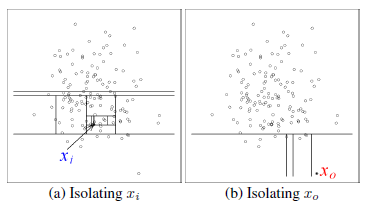
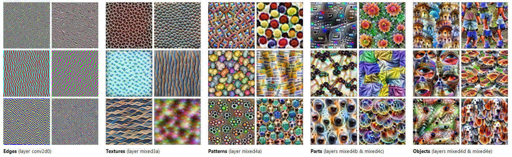
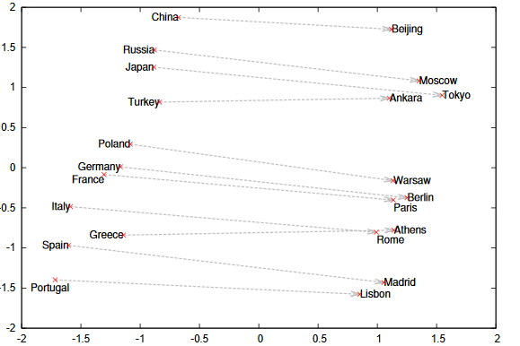
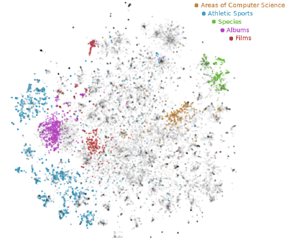

```{r setup, include=F}
# knitr options
knitr::opts_chunk$set(
  comment = ">",
  collapse = F
)

# package management
if (!require("pacman")) install.packages("pacman")
pacman::p_load(
  xaringanthemer, xaringanExtra, metathis,
  renv, tidyverse, lubridate, showtext, ggExtra
)
pacman::p_load_gh("allisonhorst/palmerpenguins", "hadley/emo")

# xaringan custom setup
xaringanthemer::style_mono_accent(
  base_color = "#000000",
  link_color = "#0000EE",
  header_font_google = google_font("Josefin Sans"),
  text_font_google = google_font("Montserrat", "700b", "400"),
  code_font_google = google_font("Fira Mono"),
  colors = c(red = "#f34213", white = "#FFFFFF"),
  code_font_size = "smaller",
  code_inline_background_color = "#F4F4F4",
  outfile = "./custom/xaringan-themer.css"
)

xaringanExtra::use_panelset()

xaringanExtra::use_extra_styles(
  hover_code_line = T,
  mute_unhighlighted_code = T
)

metathis::meta() %>%
  meta_name("github-repo" = "simonschoe/feature-engineering") %>% 
  meta_description(
    "This 1 hour workshop discusses the basic concepts and techniques of feature engineering."
  ) %>% 
  meta_social(
    title = "Feature Engineering",
    url = "https://simonschoe.github.io/feature-engineering",
    image =  "https://simonschoe.github.io/feature-engineering/img/share-card.png",
    image_alt = "Title slide for Feature Engineering",
    og_type = "website",
    og_author = "Simon Schölzel",
    twitter_card_type = "summary_large_image"
  )
```

class: center, middle, hide-count
count: false

# `r rmarkdown::metadata$title`
### `r rmarkdown::metadata$subtitle`

___

**`r rmarkdown::metadata$author`**

`r rmarkdown::metadata$date`  
.small[(updated: 2020-12-30)]

<br><br>

<a href="https://www.wiwi.uni-muenster.de/"></a> <a href="https://www.wiwi.uni-muenster.de/ctrl/aktuelles"></a> <a href="https://www.wiwi.uni-muenster.de/iff2/de/news"></a>

---

name: agenda

## Agenda

**1 Learning Objectives**

**2 The Generic Machine Learning Pipeline**

**3 Introduction to Feature Engineering**

**4 Engineering of Categorical and Numerical Features**
>4.1 Engineering of Categorical Features  
4.2 Engineering of Numerical Features  
4.3 Handling of Extreme Values  
4.4 Handling of Missing Values

**5 Excursus: Data Leakage**

**6 Feature Selection**  
>6.1 Intrinsic Methods  
6.2 Filter and Wrapper Methods
  
**7 Outlook**

---

## 1 Learning Objectives `r emo::ji("idea")`

In this workshop you will learn about the basic techniques of feature engineering. You will familiarize yourself with a toolbox of several numerical as well as visual techniques for inspecting your feature set and eventually improving the predictive performance of your machine learning models.

More specifically, after this workshop you will
- be familiar with the broad field of feature engineering, including feature transformation, feature extraction and feature selection,<br><br>
- be able to detect potential pitfalls in the representation of your categorical (`fct`) and numerical (`int`, `dbl`) features and know how to alleviate them,<br><br>
- know important techniques for detecting and handling outliers as well as missing values,<br><br>
- be aware of the concept of data leakage and how to prevent it, and<br><br>
- have a good overview of the different approaches to feature selection.

---

## 2 The Generic Machine Learning Pipeline

<br><br>

```{r, echo=F, out.width='70%', out.height='70%', fig.align='center'}
knitr::include_graphics("https://d33wubrfki0l68.cloudfront.net/571b056757d68e6df81a3e3853f54d3c76ad6efc/32d37/diagrams/data-science.png")
```

.footnote[*Source: see workshop on ["Introduction to the Tidyverse"](https://simonschoe.github.io/introduction-to-the-tidyverse/#8)*]

???
day-to-day data science workflow

---

## 2 The Generic Machine Learning Pipeline

```{r, echo=F, out.height='55%', out.width='55%', fig.align='center', out.extra='style="float:right; padding:10px"'}
knitr::include_graphics("https://ml-ops.org/img/ml-engineering.jpg")
```

**.yellow[Data Pipeline]**

>1 Data ingestion  
2 Data exploration (EDA)  
3 Data wrangling  
4 Data partitioning / resampling

**.red[ML Pipeline]**

>5 Model training  
6 Model evaluation / testing  
7 Model packaging

**.blue[Software & Code Pipeline]**

>8 Model deployment  
9 Model performance monitoring  
10 Model performance logging

.footnote[*Source: [ml-ops.org](https://ml-ops.org/content/end-to-end-ml-workflow)*]

???
1
- data acquisition: collect data
- data generation: even generate synthetic data
- data selection: select relevant data sources
- data integration: integrate selected data sources (join/merge)

2
- data profiling: categorize content and structure, i.e. generate metadata (data type, min, max, average)
- data validation: learn about data errors

3
- clean and transform data (usually most time-consuming step -> also most critical due to gigo-principle), e.g., missing value and outlier handling

4
- data partitioning and resampling: training, validation, and test datasets

5
- feature engineering
- model estimation
- hyperparameter tuning

6 

7
- exporting the model to be implementable in a business context (i.e. as part of desktop or mobile application)

8
- you feed the model into a production environment so that it becomes part of your daily operations (usable by the end-user)

9
- continuous supervision of the model performance based on unseen data (look for indications that re-training is required in case of data drift)
- **Data Drift:** the test data distribution changes -> model performance degrades without adjustments! -> use new data to retrain the model

10
- logging of queries and results in a logfile to be usable for re-training

---

## 3 Introduction to Feature Engineering

Most machine learning models require the data to be of a certain shape. That is, even small perturbations in your features can adversely affect the performance of your model. For example:
```{r, echo=F}
tibble(
  Pertubation = c(
    "Differently scaled features",
    "Highly skewed features",
    "Outliers, i.e. extreme data points",
    "Features that contain missing values",
    "Multicollinearity among features",
    "Irrelevant / uninformative features"),
  'Robust methods' = c(
    "Linear regression (scale absorbed by coefficients)",
    "Non-parametric learners (e.g., tree-based methods)",
    "Trees-based methods, robust regression",
    "CART decision trees (surrogate splits)",
    "PLS, PCA, regularized regression",
    "Stepwise selection and regularized regression"),
  'Sensitive methods' = c(
    "Distance-based learners (e.g., SVM or k-NN)",
    "Parametric learners which assume normality (e.g., linear regression)",
    "Linear regression",
    "C4.5 decision trees or certain RF implementations",
    "Linear regressions or Naive Bayes",
    "k-NN (computational costs grow exponentially)")
) %>% 
  knitr::kable(format = "html")
```

???
- free lunch theorem

---

## 3 Introduction to Feature Engineering

>[F]eature engineering - the process of creating representations of data that increase the effectiveness of a model. ~ [Kuhn, M./Johnson, K. (2019)](#references)

--

<br>
The process of **feature engineering** subsumes several interrelated steps, such as
- applying transformations to the feature set (*feature transformation*),
- creating new features from existing features (*feature extraction*), and
- omitting redundant features and retaining informative features (*feature selection*).

Moreover, the process of feature engineering may be performed in a *supervised* (data-driven) or *unsupervised* (theory- or knowledge-based) manner.

---

## 3 Introduction to Feature Engineering

**Introductory Example:** Have you ever thought about the numerous ways of representing a date feature (`2020-11-23`)? There are more options than you would think at first glance ...
<br><br><br>

**Option 1:** Number of days since *unix time* (`1970-01-01`)
```{r, echo=F}
difftime(as.Date("2020-11-23"), as.Date("1970-01-01"), units="days")
```
**Option 2:** Year, month and day of the week feature
```{r, echo=F}
print(c(lubridate::year("2020-11-23"), lubridate::month("2020-11-23"), lubridate::wday("2020-11-23", week_start = getOption("lubridate.week.start", 1))))
```
**Option 3:** Day of the year feature
```{r, echo=F}
lubridate::yday("2020-11-23")
```
**Option 4:** Boolean period indicator (`2020-06-29` < x < `2020-08-11`)
```{r, echo=F}
between(as.Date("2020-11-23"), as.Date("2020-06-29"), as.Date("2020-08-11"))
```

---

background-image: url(https://raw.githubusercontent.com/allisonhorst/palmerpenguins/master/man/figures/lter_penguins.png)
background-position: 95% 5%
background-size: 15%
layout: false

## 4.1 Engineering of Categorical Features
### 4.1.1 Encoding of Unordered Features

If a model requires only numerical data as input, categorical features must be transformed into a numerical representation. In the case of an unordered feature with $C$ levels, the feature is commonly transformed into a set of $C-1$ binary respectively dichotomous features via **one-hot encoding**.

```{r, echo=F}
penguins %>% 
  distinct(species) %>% 
  mutate(
    intercept = rep(1, 3),
    species_gentoo = if_else(species == "Gentoo", 1, 0),
    species_chinstrap = if_else(species == "Chinstrap", 1, 0)
  )
```

.footnote[
*Note: If your linear model includes an intercept and you generate $C$ dummies, one for each factor level, your final model is overdetermined, i.e. the intercept can always be computed as a linear combination of the $C$ dummies (adding up to one). In this case the OLS algorithm may fail as your feature matrix is not invertible.*
]

???
- overdetermination implies that one variable can always be safely predicted using all the others -> this introduces perfect multicollinearity by design

---

## 4.1 Engineering of Categorical Features
### 4.1.2 Encoding of Ordered Features

In the case of ordered factor levels (e.g., `low`, `medium` and `high`), we may resort to the following approaches:

1. One-hot encoding to generate binary dummies (omits information included in relative ordering)
2. Representation as a feature of type integer (`int`) with equal intervals between factor levels
3. Encoding via <a href="https://en.wikipedia.org/wiki/Contrast_(statistics)">polynomial contrasts</a> to produce a numeric (`dbl`) representation

--

**Linear** (**quadratic**) **polynomial contrasts:**
```{r, echo=F}
tibble(
  level = c("low", "medium", "high") %>% as.factor(),
  coef_linear = c(-0.71, 0, 0.71),
  coef_quadratic = c(0.41, -0.82, 0.41)
)
```

.footnote[
*Note: Theoretically, a polynomial contrast can model most non-linear shapes in the relationship between the response and the categorical feature of up to degree $C-1$. Yet, in practice the exploration of polynomial contrasts does rarely exceed polynomials of degree 2 [[1]](#references).*
]

---

## 4.1 Engineering of Categorical Features
### 4.1.3 Aggregation of Near-Zero Variance Features

If some feature levels occur rarely, the feature is often considered a **near-zero variance** (**zv**) feature. This is frequently the case for categorical features of high cardinality (i.e. where $C$ is large).

For these imbalanced features, one-hot encoding becomes computationally demanding. Simultaneously, certain feature levels may never realize during resampling (e.g., cross-validation) which results in a binary predictor containing only zeros in a given split.

--

**Rule-of-thumb for zv features:** $\frac{No.\:of\:zeros}{No.\:of\:ones}>19$ (i.e. relative frequency below 5%) [[1]](#references)
```{r, echo=F}
penguins %>% 
  count(island) %>% 
  mutate(ratio = (sum(n) - n) / n)
```

If a feature is considered a zv feature, a potential remedy is to lump together rare feature levels into an `"other"` category (e.g., using `forcats::fct_lump()`).

???
- one hot encoding introduces high sparsity

---

## 4.2 Engineering of Numerical Features
### 4.2.1 (1:1)-Transformations

**Log-transformation** and **inversion**: Resolves skewness and shifts the distribution closer to a Gaussian
.pull-left[
```{r, echo=F, fig.width=8, fig.asp=0.618, fig.retina=3, out.extra='style="float:left; padding:10px"'}
penguins %>% 
  drop_na %>% 
  ggplot() +
    geom_density(aes(x = body_mass_g), fill = "blue", alpha = .2) +
    labs(
      title = "Orginal Scale",
      x = "Body mass [grams]",
      y = "Statistical density"
    ) +
    theme_classic() +
    theme(
      plot.title = element_text(size = 20, face = "bold"),
      axis.text.x = element_text(size = 14),
      axis.text.y = element_blank(),
      axis.title = element_text(size = 14),
    ) 
```
]
.pull-right[
```{r, echo=F, fig.width=8, fig.asp=0.618, fig.retina=3, out.extra='style="float:left; padding:10px"'}
penguins %>% 
  drop_na %>% 
  ggplot() +
    geom_density(aes(x = log(body_mass_g)), fill = "blue", alpha = .2) +
    labs(
      title = "Logarithmic Scale",
      x = "Log body mass [grams]",
      y = "Statistical density"
    ) +
    theme_classic() +
    theme(
      plot.title = element_text(size = 20, face = "bold"),
      axis.text.x = element_text(size = 14),
      axis.text.y = element_blank(),
      axis.title = element_text(size = 14),
    ) 
```
]

???
- Note: Some of these transformations are problematic for zero or negative values (e.g., log of zero). In such cases simple corrections are available to address these issues.

---

## 4.2 Engineering of Numerical Features
### 4.2.1 (1:1)-Transformations

**Box-Cox power transformation** [[2]](#references): Resolves skewness and shifts the distribution closer to a Gaussian

$$Y^{(\lambda)}=\frac{Y^{\lambda }-1}{\lambda} \quad for \quad \lambda \neq 0$$

$$Y^{(\lambda)}=ln(Y) \quad  for \quad {\lambda} = 0$$

$\lambda$ is considered the so called *power parameter* which can be estimated via maximum likelihood estimation or hyperparameter tuning. Certain values for $λ$ correspond to commonly known transformations:
- $\lambda = \;\;\;1$: no transformation
- $\lambda = \;\;\;0$: log transformation
- $\lambda = 0.5$: square root transformation
- $\lambda = -1$: inversion

---

## 4.2 Engineering of Numerical Features
### 4.2.1 (1:1)-Transformations

.pull-left[
$\textbf{z}$**-normalization:** Modifies the scale of a predictor

$$Z=\frac{X-\mu } {\sigma}$$

The $z$-normalization involves two steps:
- *centering* (subtracting the mean), and
- *scaling* (dividing by the standard deviation).

Afterwards, the distribution of $Z$ is characterized by a mean of 0 and a standard deviation of 1. Hence, if $Z$ is normally distributed, it will be standard normally distribution subsequent to the normalization step.
]

--

.pull-right[
**Min/max-scaling:** Modifies the scale of a predictor

$$X'=  \frac{X - min(X)}{max(X) - min(X)}$$

Min/max-scaling projects data points onto the $[0; 1]$-interval.

A generalization of min/max-scaling is **range scaling** where the data points are projected onto an arbitrary interval.
]

???
z-transf: makes values harder to interpret
min/max: These may be relevant for special algorithms that require the data to be in this specific format (e.g., certain neural network architectures).

---

## 4.2 Engineering of Numerical Features
### 4.2.2 (1:N)-Transformations

**Basis expansion:** Establishes non-linear relationships between a predictor and the response by adding polynomials (e.g., quadratic and cubic terms)
```{r, eval=F}
penguins %>% 
  dplyr::mutate(
    bill_length_mm = flipper_length_mm^2, # add quadratic term
    bill_length_mm = flipper_length_mm^3  # add cubic term
  )
```

This enables us to specify additive models that account for a potential non-linear relationship in the form of:

$$Y=X + X^2 + X^3 +\:...$$

.footnote[
*Note: A technique related to basis expansion is the inclusion of __interaction terms__ which model non-linear relationship between multiple predictors and the response.*
]

---

## 4.2 Engineering of Numerical Features
### 4.2.2 (1:N)-Transformations

**Discretization:** Reduces a numeric feature to a set of categorical features
.pull-left[
```{r, echo=F, fig.width=8, fig.asp=0.618, fig.retina=3, fig.align='center'}
penguins %>% 
  drop_na %>% 
  ggplot(aes(x = body_mass_g)) +
    geom_histogram(bins = 5, color = "black", fill = "blue", alpha = .2) +
    labs(
      title = "Discretization into 5 bins",
      x = "Body mass [grams]",
      y = "Frequency"
    ) +
    theme_classic() +
    theme(
      plot.title = element_text(size = 20, face = "bold"),
      axis.text.x = element_text(size = 14),
      axis.text.y = element_blank(),
      axis.title = element_text(size = 14),
    ) 
```
]
.pull-right[
In certain cases, binning helps to reduce complexity in the relationship between $X$ and $Y$ and hence facilitates the interpretation.

However, it should only be used with caution as
- it is accompanied by an information loss,
- it may obscure the relation between $X$ and $Y$,
- bins are often assigned subjectively, and
- the model performance oftentimes suffers.
]
.pull-right[.footnote[
*Note: The `dplyr::cut_width()` function is a good place to start when discretizing numerical predictors.*
]]

---

## 4.2 Engineering of Numerical Features
### 4.2.2 (1:N)-Transformations

**Discretization:** Reduces a numeric feature to a set of categorical features
.pull-left[
```{r, echo=F, fig.width=8, fig.asp=0.618, fig.retina=3, fig.align='center'}
penguins %>% 
  drop_na %>% 
  ggplot(aes(x = body_mass_g)) +
    geom_histogram(bins = 15, color = "black", fill = "blue", alpha = .2) +
    labs(
      title = "Discretization into 15 bins",
      x = "Body mass [grams]",
      y = "Frequency"
    ) +
    theme_classic() +
    theme(
      plot.title = element_text(size = 20, face = "bold"),
      axis.text.x = element_text(size = 14),
      axis.text.y = element_blank(),
      axis.title = element_text(size = 14),
    ) 
```
]
.pull-right[
In certain cases, binning helps to reduce complexity in the relationship between $X$ and $Y$ and hence facilitates the interpretation.

However, it should only be used with caution as
- it is accompanied by an information loss,
- it may obscure the relation between $X$ and $Y$,
- bins are often assigned subjectively, and
- the model performance oftentimes suffers.
]
.pull-right[.footnote[
*Note: The `dplyr::cut_width()` function is a good place to start when discretizing numerical predictors.*
]]

???
- here, indicator of bi- or tri-modal distribution
- Discretize data by fitting a tree to it

---

## 4.2 Engineering of Numerical Features
### 4.2.3 (N:N)-Transformations

**Dimensionality reduction techniques:** Generate uncorrelated predictors to resolve multicollinearity
.pull-left[
```{r, echo=F, fig.width=8, fig.asp=0.618, fig.retina=3, fig.align='center'}
penguins %>% 
  drop_na %>% 
  prcomp(~ bill_length_mm + bill_depth_mm + flipper_length_mm + body_mass_g, data = ., scale = TRUE) %>% 
  .$x %>%
  as_tibble %>% 
  mutate(class = penguins %>% drop_na %>% pull(species)) %>% 
  ggplot(aes(x = PC1, y = PC2, color = class)) +
    geom_point() +
    labs(
      title = "PC1 and PC2 Scatterplot",
      subtitle = "PCA for bill_length_mm, bill_depth_mm, flipper_length_mm, body_mass_g",
      x = "First principal component",
      y = "Second principal component"
    ) +
    theme_classic() +
    theme(
      plot.title = element_text(size = 20, face = "bold"),
      plot.subtitle = element_text(size = 14, face = "bold"),
      axis.text.x = element_text(size = 14),
      axis.text.y = element_blank(),
      axis.title = element_text(size = 14),
    ) 
```
]
.pull-right[
The underlying idea of dimensionality reduction techniques is to extract more informative features from the existing feature set. Usually, this comes at the expense of interpretability.

**Principal Component Analysis** (**PCA**) generates uncorrelated features as linear combinations of existing features in an *unsupervised* manner.

**Partial Least Squares** (**PLS**) **Regression** generates uncorrelated features in a *supervised* manner, i.e. by taking the relationship with the response into account.
]

---

layout: false
class: center, middle

# 5-Minute Break<br><br>`r emo::ji("coffee")` `r emo::ji("doughnut")`

---

## 4.3 Handling of Extreme Values
### 4.3.1 Outliers

> An outlier is a datapoint that deviates so much from other observations that one might assume a different underlying sampling mechanism. ~ [Enderlein, G. (1987)](#references)

The removal of outliers must be guided by the employed model and is context-dependent:
- On the one hand, the presence of an outlier can be due to errors in the data collection processes.
- On the other hand, an outlier can be a very informative and valuable data point.

A good idea is to run the analysis with and without outliers and compare the results. However, in order to do so, the outliers must be identified in the first place.

--

<br><br>
`r emo::ji("graph")` **Visual detection techniques:** histograms, scatterplots, boxplots, etc.

`r emo::ji("abacus")` **Numerical detection techniques:** $z$-score, interquartile range, Cook's distance

---

## 4.3 Handling of Extreme Values
### 4.3.2 Outlier Detection `r emo::ji("graph")`

.pull-left[
```{r, echo=F, fig.width=8, fig.asp=0.618, fig.retina=3, fig.align='center'}
penguins %>% 
  drop_na %>% 
  ggplot(aes(x = species, y = body_mass_g)) +
    geom_boxplot(varwidth = T) +
    geom_jitter(aes(color = species), alpha = 0.3, width = 0.3) +
    scale_y_continuous(breaks = seq(2000, 7000, 500)) +
    labs(y = "Body mass [grams]") +
    theme_classic() +
    theme(
      axis.text.x = element_text(size = 14),
      axis.text.y = element_text(size = 14),
      axis.title = element_text(size = 14),
      axis.title.x = element_blank()
    ) 
```
]
.pull-right[
**Boxplots elements:**
- **Horizontal line:** Median<br><br>
- **Box area:** Interquartile range ( $IQR$ ), corresponds to the $[Q_{0.25}; Q_{0.75}]$-interval<br><br>
- **Hinge length:** Max. $1.5 * IQR$<br><br>
- **Outliers:** Points beyond the hinges
]

???
- outliers indicated here as black dots

---

## 4.3 Handling of Extreme Values
### 4.3.2 Outlier Detection `r emo::ji("graph")`

.pull-left[
```{r, echo=F, fig.width=8, fig.asp=0.618, fig.retina=3, fig.align='center', messages=F}
p <- penguins %>% 
  drop_na %>% 
  ggplot(aes(x = body_mass_g, y = bill_depth_mm)) +
    geom_jitter(aes(color = species)) +
    labs(
      x = "Body mass [grams]",
      y = "Bill depth [millimeters]"
    ) +
    theme_classic() +
    theme(
      legend.position = "none",
      axis.text.x = element_text(size = 14),
      axis.text.y = element_blank(),
      axis.title = element_text(size = 14),
    ) 

ggExtra::ggMarginal(p, groupColour = TRUE, groupFill = TRUE)
```
]
.pull-right[
**Scatterplots with marginal densities:** Convenient tool for identifying outliers in two dimensions
- Even if a data point is extreme with respect to one predictor, its value with respect to other predictors can be entirely unremarkable.<br><br>
- Outlier detection in higher dimensions requires techniques which take the whole feature space into account.
]

.pull-right[
.footnote[
*Note: Marginal density plots can be generated by combining `ggplot2` with the `ggExtra` package.*
]]

---

## 4.3 Handling of Extreme Values
### 4.3.2 Outlier Detection `r emo::ji("abacus")`

Numerical approaches for outlier detection and correction usually involve some form of *truncation* or *trimming* (i.e. elimination). Extreme values are either capped respectively artificially lowered or entirely removed from the data set to reduce their influence on the predictive model.

--

Some prominent techniques for pinpointing the truncation respectively trimming threshold are:
- $\textbf{z}$**-score correction:** correct if $z$-score lies outside the $[1.96; -1.96]$-interval<br><br>
- $\textbf{IQR}$ **correction:** correct if value lies outside of the $IQR$ , i.e. on the hinges of the Boxplot<br><br>
- **Winsorizing:** correct if value exceeds/undercuts a certain percentile, e.g., 95% (similar to $z$-score)

???
- -1.96 till 1.96 sd of the mean: 95% of the data

---

## 4.3 Handling of Extreme Values
### 4.3.2 Outlier Detection `r emo::ji("abacus")`

.pull-left[
A more sophisticated, multidimensional approach goes by the name of **Cook's distance** [[4]](#references). It is a measure that quantifies the sensitivity of a model to the exclusion of a single observation, due to
- a large residual, i.e. a poor prediction, and
- high leverage, i.e. extreme feature values.

$$D_i=\frac{e_i^2}{p*s^2} \left[\frac{h_{ii}}{(1- h_{ii} )^2}\right]$$

]
.pull-right[
```{r, echo=F, fig.width=8, fig.asp=0.618, fig.retina=3, fig.align='center', messages=F, warnings=F}
lin_reg_mod <- penguins %>% 
  drop_na %>% 
  lm(flipper_length_mm ~ body_mass_g, data = ., y = T, x = T)

penguins_pred <- tibble(
  x = lin_reg_mod$x[,2],
  y = lin_reg_mod$y,
  y_hat = lin_reg_mod$fitted.values,
  resid = lin_reg_mod$residuals
) 

penguins_pred %>% 
  ggplot(aes(x = x, y = y)) +
    geom_point(size = 1) +
    geom_point(
      data = penguins_pred %>% slice_max(x, n = 3),
      aes(color = "High leverage"), size = 4, alpha = .5) + 
    geom_point(
      data = penguins_pred %>% slice_max(resid, n = 5),
      aes(color = "Large residual"), size = 4, alpha = .5) + 
    geom_vline(xintercept = mean(penguins_pred$x), lty = "dashed") +
    geom_smooth(formula = y ~ x, method = "lm") +
    labs(
      x = "Body mass [grams]",
      y = "Flipper length [millimeters]"
    ) +
    theme_classic() +
    theme(
      axis.text.x = element_text(size = 14),
      axis.text.y = element_blank(),
      axis.title = element_text(size = 14),
    ) 
```
]

.footnote[.pull-left[
*Note: You can find numerous references in the literature with regards to the optimal cutoff. Commonly, a value of 1 is applied as a threshold for truncation respectively trimming.*
]]

---

## 4.3 Handling of Extreme Values
### 4.3.2 Outlier Detection `r emo::ji("abacus")`

Finally, also the machine learning community has contributed to novel, data-driven detection techniques. A prominent approach is the so-called **isolation tree** (resp. **isolation forest** [[5]](#references)).

.pull-left[
**Main intuition:**
- Due to their uniqueness, outliers are separated early on in the partitioning procedure. Hence, they are closer to the *root* of the tree.
- The fewer splits are required to isolate a sample (i.e. the shorter the *path length*), the more likely the sample is an outlier.
- By ranking each observation by its path length, outliers can be identified.
]
.pull-right[
```{r, message=F, echo=F, fig.align='center', out.width='80%', out.height='80%'}

```
]

**Decision rule:** Relatively short (long) path length indicate outliers (normal samples). Relatively homogeneous path length across all samples suggest the absence of outliers.

???
skip

---

## 4.4 Handling of Missing Values
### 4.4.1 Missing Values

Some methods react highly sensitive to the presence of missing values (`NA`). That is, in certain cases `R` might not even be able to fit a model in the presence of missing values.

**Types of missing values:**
- **Structural `NA`:** Relate to missing values that are structurally motivated (e.g., number of births per man).<br><br>
- **Random `NA`:** Relate to missing values that are due to randomness in the data generating process.
  - *Missing completely at random (MCAR):* The likelihood of `NA` is independent of the variable itself as well as any other variable in the data set. [[6]](#references)
  - *Missing at random (MAR):* The likelihood of `NA` is independent of the variable itself, but can be explained by other variables in the data set. [[6]](#references)<br><br>
- **Non-random `NA`:** The likelihood of `NA` depends only on the variable itself (e.g., negative customer reviews). This type of `NA` is considered informative and referred to as *not missing at random (NMAR)*. [[6]](#references)

???
Often, it is really non-trivial to come by the reason of an NA:
- usually requires domain knowledge
- usually requires information about the data collection/generating process

---

## 4.4 Handling of Missing Values
### 4.4.2 Missing Value Detection

.pull-left[
**Missing value heatmap:** `r emo::ji("graph")`
```{r, echo=F, fig.width=8, fig.asp=0.618, fig.retina=3, fig.align='left'}
penguins %>%
  mutate(
    across(everything(), ~if_else(is.na(.) == T, 1, 0) %>% as.factor()),
    id = row_number()) %>% 
  pivot_longer(cols = c(everything(), -id), names_to = "var", values_to = "val") %>% 
  ggplot(aes(x = var, y = id)) +
    geom_tile(aes(fill = val)) +
    scale_fill_manual(values = c("white", "black")) +
    scale_y_continuous(breaks = seq(0, 500, 10)) +
    labs(
      y = "Sample ID"
    ) +
    theme_classic() +
    theme(
      legend.position = "none",
      axis.text.x = element_text(size = 14, angle = 90, vjust = 0.5, hjust = 1),
      axis.title = element_text(size = 14),
      axis.title.x = element_blank()
    ) 
```
]
.pull-right[
**Check number of `NA` per feature:** `r emo::ji("abacus")`
```{r, eval=F}
penguins %>% 
  purrr::map_dfc(., ~ sum(is.na(.)))
```
**Filter for missing values:** `r emo::ji("abacus")`
```{r, eval=F}
penguins %>% 
  dplyr::filter(
    rowSums(across(everything(), ~ is.na(.))) > 0
  )
```
]

---

## 4.4 Handling of Missing Values
### 4.4.3 Missing Values: Handling of Random `NA`

**Removal:** Discard the observation (row) or predictor (column) containing the `NA`
- Discard the observation (row) if the data set is relatively large or `NA`s are rare.
- Discard the predictor (column) if it is highly correlated with other predictors not subject to `NA`. 

**Robust algorithms:** Use algorithms that are robust to the presence of `NA`. For example, the *CART* algorithm for decision trees effectively handles missing values by enabling surrogate splits. Alternatively, [[7]](#references) discusses outlier robust estimators in the context of linear regression.

???
comment on removal: usually you would want to keep as many observations as possible. removal only really is feasible in the presence of big data

---

## 4.4 Handling of Missing Values
### 4.4.3 Missing Values: Handling of Non-Random `NA`

**Mean-/median-imputation:** Impute `NA` using central tendency measures, e.g., the mean or median

**Model-based imputation:** Impute `NA` using an adaptive model (i.e. *imputation learner*) that predicts the missing value using all other non-missing predictors
- The choice of the imputation learner is independent of the main prediction algorithm. You may even use a flexible imputation learner, if the final prediction model is only a simple linear regression.
- Since an individual imputation learner is required for each `NA`, the model should be efficiently implementable (e.g., k-NN or decision trees).

**`NA` as categorical predictor:** Create a binary feature that indicates the presence of a `NA`. This way it can be assessed whether the `NA`-dummy is predictive of the response. However, as the true data is missing in the first place, this approach will not lead to any explanation of why this relationship may be informative.

.footnote[
*Note: These approaches assume that there is no option of acquiring the missing values ex post (which should always be you first priority if affordable).*
]

---

## 5 Excursus: Data Leakage `r emo::ji("droplet")`

**Intuition:** Feature engineering techniques, such as transformations (e.g., $z$-normalization), outlier correction (e.g., winsorization) or missing values handling (e.g., mean-imputation), depend on the concrete train-test-split (i.e. the training observations) as part of the validation set or cross-validation approach:

- $z$*-normalization:* The mean and standard deviation depend on your data set.<br><br>
- *Winsorization:* The definition of an outlier is relative to the other observations in your data set.<br><br>
- *Mean-imputation:* The estimated mean depends on the concrete predictor values in your data.

Hence, these approaches must be incorporated into the modeling pipeline by estimating them on the training data and then applying them to the unseen test data.

---

## 5 Excursus: Data Leakage `r emo::ji("droplet")`

.pull-left[
A violation of this practice is called **data leakage**:
- Information from outside the training set (i.e. the test set) leak into the model training step.<br><br>
- The result is an over-optimistic model that performs extremely well on the test set as it has already seen some of the test samples.<br><br>
- It likely occurs when computations are performed over the whole data instead of just the training set.
]
.pull-right[
```{r, echo=F, out.width='70%', fig.align='center'}
knitr::include_graphics("./img/leakage-meme.jpg")
```
]
.footnote[
*Note: Revisit online lecture 5 on resampling methods (in particular slides 17-21). This [blog post](https://machinelearningmastery.com/data-leakage-machine-learning/) and [podcast episode](https://www.youtube.com/watch?v=dI5oGNTi6Ys) are also great resources for getting an intuitive understanding of data leakage.*

*Source: [deeplearning.ai](https://www.linkedin.com/posts/deeplearningai_reminder-dont-train-on-test-data-creds-activity-6647926795935068160-NhSd).*
]

---

## 6 Feature Selection

In general, there is little theory on how to best engineer your features. Thus, you may begin engineering a large set of feature candidates which you then narrow down. Ideally, you will be able to drop all features that do not contain any information for predicting the response. This approach is known as **feature selection**.

--

**Reasons for feature selection:**
- Parsimonious models are easier to interpret.
- A reduced set of features increases training speed and lowers the cost of data collection and storage.
- Feature selection helps to tackle the problem of *overfitting* and reduces the dimensionality.
- Certain models react highly sensitive to correlated predictors (e.g., linear regressions).
- Certain models react highly sensitive to uninformative predictors (e.g., SVM).

--

**Approaches to feature selection:**
- Intrinsic methods `r emo::ji("package")`
- Filter methods `r emo::ji("magnifying glass tilted right")`
- Wrapper methods `r emo::ji("counterclockwise arrows button")`

---

## 6 Feature Selection
### 6.1 Intrinsic Methods `r emo::ji("package")`

Intrinsic methods provide inherent feature selection capabilities. This broadly refers to all methods that have some type of regularization built-in, such as Lasso regression or pruned decision trees.

- Feature selection is directly linked to the objective function (e.g., RMSE or misclassification error). 
- Intrinsic methods are model dependent and usually do not apply to other methods in the same way.
- Oftentimes, they are *greedy* in their search for an optimal solution.

--
___

```{r, echo=F, out.height='30%', out.width='30%', out.extra='style="float:left; padding:20px"'}
knitr::include_graphics("https://tenor.com/view/cookies-gif-14785632.gif")
```
<br>
**Greedy algorithms:** Search for the best immediate solution without re-evaluating past choices. Greedy algorithms usually find *local optima* (e.g., stepwise subset selection).

**Non-greedy algorithm:** Search for the best overall solution by re-evaluating past choices. Non-greedy algorithms are better suited for finding *global optima* (e.g., genetic algorithms or simulated annealing).

???
non-greedy: can move in unfavorable direction first, if it turns out to be beneficial later

---

## 6 Feature Selection
### 6.2 Filter Methods `r emo::ji("magnifying glass tilted right")` and Wrapper Methods `r emo::ji("counterclockwise arrows button")`

.pull-left[
**Filter methods** [[8]](#references) discard features based on domain knowledge or statistical indicators, e.g., correlations, chi-square scores, $p$-values or odds-ratios. These methods are
- rather *heuristic* by nature,
- commonly applied once,
- model-agnostic (i.e. model-independent),
- usually based on univariate/bivariate examinations (no interactions), and
- computationally cheap.
]

--

.pull-right[
**Wrapper methods** [[8]](#references) wrap the process of model training and feature selection into a for-loop and successively discard irrelevant features. These methods are
- rather *model-driven* by nature,
- iterative search procedures,
- based on multivariate examinations of the feature space,
- computationally expensive, and
- require validation sets for model assessment.
]

--

**Potential search strategy:** (1) Start with intrinsic methods or filter methods where you are confident about the applied filters. (2) Migrate to wrappers if you have found a model specification that works for you.

???
summary:
- intrinsic: the model has selection capabilities
- filter: you perform the selection
- wrapper: selection is wrapped into an approach that optimizes a user-defines loss function

---

## 7 Outlook
### Unsupervised Feature Extraction aka Representation Learning

```{r, echo=F, fig.align='center'}

```

.footnote[*Source: Article on [Distill](https://distill.pub/2017/feature-visualization/) by Chris Olah.*]

---

## 7 Outlook
### Unsupervised Feature Extraction aka Representation Learning

.pull-left[
```{r, echo=F, fig.align='center', out.height='80%', out.width='80%'}

```

.footnote[*Source: [[9]](#references-2)*]
]
.pull-right[
```{r, echo=F, fig.align='center', out.height='80%', out.width='80%'}

```

.footnote[*Source: [[10]](#references-2)*]
]

---

name: references

## References

[1]: **Kuhn, M./Johnson, K. (2019):** Feature Engineering and Selection: A Practical Approach for Predictive Models. URL: http://www.feat.engineering/.

[2]: **Box, G. E. P./Cox, D. R. (1964):** An Analysis of Transformations. Journal of the Royal Statistical Society, Series B (Methodological), Vol. 26, 1964, No. 2, pp. 211-252.

[3]: **Enderlein, G. (1987):** Identification of Outliers. Biometrical Journal, Vol. 29, 1987, No. 2, p. 198.

[4]: **Cook, D. R./Weisberg, S. (1982):**. Residuals and Influence in Regression. Chapman & Hall: New York 1982.

[5]: **Liu, F. T./Ting, K. M./Zhou, Z. H. (2008):** Isolation Forest. 8th IEEE International Conference on Data Mining. pp. 413-422. URL: https://cs.nju.edu.cn/zhouzh/zhouzh.files/publication/icdm08b.pdf?q=isolation-forest.

[6]: **Little, R. J./Rubin, D. B. (2019):** Statistical Analysis with Missing Data. 3rd edition. John Wiley & Sons: Hoboken 2019.

[7]: **Anderson, R. (2008):** Modern Methods for Robust Regression. SAGE Publications: Thousan Oaks et al. 2008.

[8]: **Kohavi, R./George, H. J. (1997):** Wrappers for Feature Subset Selection. Artificial intelligence Vol. 97, 1997, No. 1-2, pp. 273-324.

---

name: references-2

## References

[9]: **Mikolov, T., et al. (2013):** Distributed Representations of Words and Phrases and Their Compositionality. NIPS 2013. URL: http://papers.nips.cc/paper/5021-distributed-representations-of-words-and-phrases-and-their-compositionality.pdf.

[10]: **Dai, A. M./Olah, C./Le, Q. V (2015):** Document Embedding with Paragraph Vectors. arXiv Working Paper 2015-07-29. URL: https://arxiv.org/pdf/1507.07998.pdf.

## Further Resources

**Kuhn, M./Johnson, K. (2019):** Feature Engineering and Selection: A Practical Approach for Predictive Models. URL: http://www.feat.engineering/.

**Kuhn, M./Johnson, K. (2013):** Applied Predictive Modeling. Chapter 3 (Data Pre-processing). Springer: New York 2013.

**Hastie, T./Tibshirani, R./Friedman, J. (2017):** The Elements of Statistical Learning: Data Mining, Inference, and Prediction. Chapter 9.6 (Missing Data). 2nd edition, 12th printing with corrections. Springer: 2017. URL: https://web.stanford.edu/~hastie/ElemStatLearn/printings/ESLII_print12.pdf.
